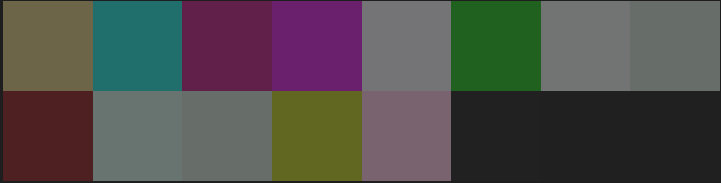

# Encode string as image & vice-versa

## How it works:
- Each character in the file can be represented as a numeric value from **0 to 255**
  - because each byte can be numerically represented using its **Decimal ASCII code**
- Creates a numpy array from each character's numeric value
- Each value can be taken as a rbg value since the values range from **0 to 255** 
- Reshape the array as a 3-dimensional array of shape: `h * w * 3`
  - `h`: height of the output image
  - `w`: width of the output image
  - `3`: for `R`, `G`, & `B`
- This array can now be converted to image

## Example:
If we have a text file with content:
```text
Hello I am just a string! Nothing fancy!!!
```

This will be encoded as image as such:

_since the text content is very less, the resulting image size will be very very small(8 * 2 in this case)_

**_You can also see the `sample.txt` & its encoded file `sample.png` in the directory_**

## How to use:
- Clone the repo 
- Install requirements with `pip install -r requirements.txt`

- Encoding
  - ***Note: Make sure you don't have too little string data*** 
  - Create a `.txt` file  with the content that you want to encode as image
  - Run `python encode.py my-text.txt`
- After completion you should see a new image on current directory as `my-text.png`
- Decoding:
  - Make sure you have an encoded image  
  - Run `python decode.py my-text.png`
  - After completion you should see a new text file with decoded data as `decoded-my-text.txt`
